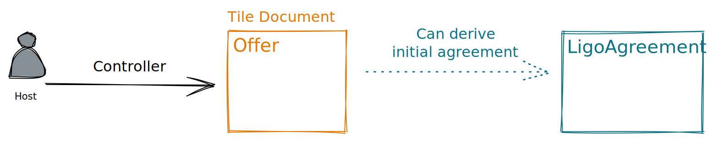

An **offer** is a [Ceramic Tile Document](https://developers.ceramic.network/reference/stream-programs/tile-document/) that is controlled by the host. It must conform to [Offer](Offer.md).

An offer should include all the information necessary for a renter to determine if they would like to request a booking, as well as the information necessary for the renter to proceed with making a request.

The host will need a [Decentralized Identifier (DID)](https://www.w3.org/TR/did-core/) to control their offers.

---
## Appendix
### Open Questions
- What `family` and `tags` should the documents have?
- Ceramic is working on an indexing solution that will help discover these offers
- Ceramic is working on a new stream type to replace TileDocument, but will be very similar